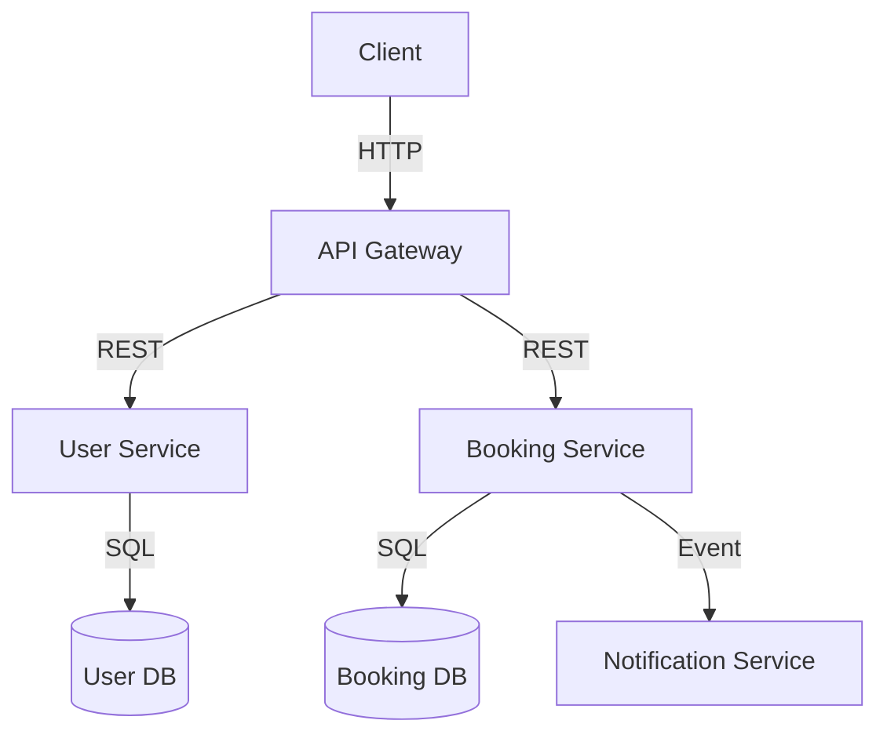
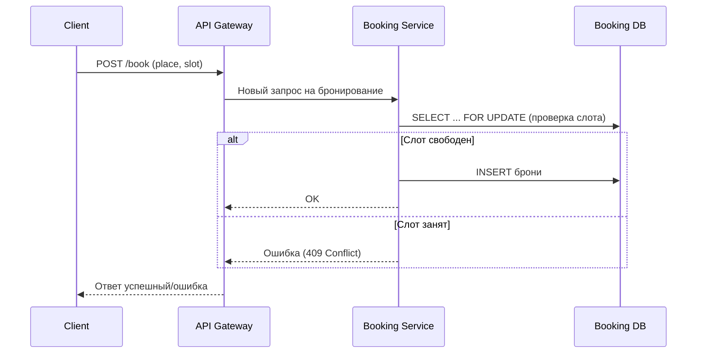
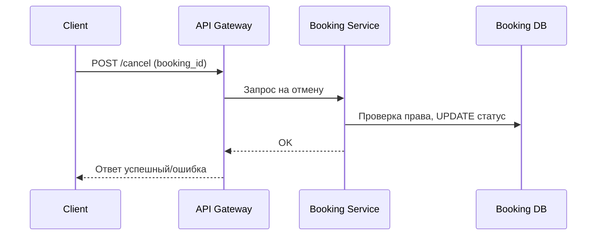

# Техническое решение проекта «Распределённая система онлайн-бронирования мест в коворкинге»


## Введение

**Описание:**  
Данный проект реализует распределённую систему для бронирования рабочих мест в коворкинге. Прототип предназначен для демонстрации базовых принципов построения отказоустойчивых и масштабируемых систем. Система позволяет пользователям регистрироваться, просматривать свободные места, бронировать их на определённые временные слоты, отменять бронирования и просматривать свою историю операций. Архитектура построена по принципам микросервисов и распределённого хранения состояния.

**Цель:**  
Разработать прототип распределённой системы бронирования, устойчивый к сбоям узлов и при этом поддерживающий консистентность данных при высокой нагрузке.

**Задачи:**  
- Реализовать регистрацию и аутентификацию пользователей.
- Обеспечить просмотр и фильтрацию свободных мест по дате, времени и зонам коворкинга.
- Разработать функционал бронирования и отмены брони.
- Реализовать отображение истории бронирований пользователя.
- Обеспечить уникальность брони на одно место в один слот.
- Гарантировать отказоустойчивость и горизонтальную масштабируемость.
- Подготовить техническую и пользовательскую документацию.
- Покрыть функциональность тестами.

**Основание:**  
Учебная практика по курсу "Основы распределённых вычислений".

**Состав команды:**  
- Шитов Иван Алексеевич — Team Lead, Fullstack Developer 
- Осипов Илья — Fullstack Developer  

---

## Глоссарий

| Термин             | Определение                                                         |
|--------------------|---------------------------------------------------------------------|
| Пользователь       | Зарегистрированный клиент системы                                   |
| Слот               | Временной интервал (обычно 1 час), на который можно забронировать место |
| Рабочее место      | Физическое место в зале коворкинга, доступное для бронирования      |
| Бронирование       | Операция резервирования места на определённый слот                  |
| API Gateway        | Входная точка для всех HTTP-запросов клиентов                      |
| Booking Service    | Сервис, обрабатывающий операции бронирования и отмены              |
| User Service       | Сервис, отвечающий за регистрацию, аутентификацию и данные пользователей |
| Slot Service       | Сервис, управляющий расписанием и доступными слотами               |
| Notification Service| Сервис отправки email-уведомлений (опционально)                   |
| DB                 | База данных, используемая для хранения пользовательских и бронирований данных |
| Консистентность    | Свойство, при котором данные о занятости слота не расходятся между сервисами |
| Горизонтальная масштабируемость | Возможность увеличения числа обслуживающих сервисов без изменения логики |

---

## Функциональные требования

### Регистрация и аутентификация
- Пользователь может зарегистрироваться, указав email и пароль.
- Пользователь может войти в систему по email и паролю.
- Все действия пользователя происходят только после аутентификации.

### Просмотр рабочих мест и слотов
- Пользователь может увидеть список всех рабочих мест в коворкинге.
- Пользователь может выбрать дату и увидеть доступные слоты по каждому месту.
- Система отображает только свободные для бронирования места.

### Бронирование
- Пользователь может выбрать свободное место и слот, подтвердить бронирование.
- Система предотвращает множественное бронирование одного места на один слот.
- В случае успеха система возвращает подтверждение бронирования.
- При попытке бронировать занятое место/слот пользователь получает ошибку.

### Отмена бронирования
- Пользователь может отменить ранее сделанное бронирование, если слот ещё не наступил.
- После отмены слот снова становится доступным для бронирования.

### История
- Пользователь может просмотреть список всех своих бронирований с деталями: место, дата, время, статус (активно/отменено/прошло).

---

## Ограничения

- Работает только с одним коворкингом с фиксированным количеством мест и слотов (можно расширить в будущем).
- Каждый пользователь может иметь не более одной брони на один слот.
- Система не реализует оплату бронирования.
- Регистрация и вход — только через email+пароль без подтверждения почты (MVP).
- Сервис уведомлений — опционален, не обязателен для MVP.

---

## Нефункциональные требования

- **Доступность:** ≥ 99.9%
- **Время отклика:** ≤ 200 мс при ≤ 100 одновременных пользователей
- **Отказоустойчивость:** система продолжает работу при сбое любого одного узла
- **Горизонтальная масштабируемость:** сервисы могут масштабироваться независимо
- **Консистентность:** невозможность двойного бронирования одного места на один слот даже при конкурентных запросах
- **Безопасность:** хранение паролей только в хэшированном виде

---

## Пользовательские сценарии (User Stories)

### Сценарий 1: Регистрация нового пользователя
1. Пользователь открывает форму регистрации, вводит email и пароль.
2. Система проверяет уникальность email и создаёт новый аккаунт.
3. Пользователь получает возможность войти в систему.

### Сценарий 2: Просмотр доступных мест и слотов
1. Пользователь выбирает дату, видит схему зала или список мест.
2. Система показывает свободные места и их доступные слоты.
3. Пользователь выбирает интересующее место и слот.

### Сценарий 3: Бронирование рабочего места
1. Пользователь выбирает место и слот, подтверждает бронирование.
2. Система проверяет, свободен ли слот, и создаёт бронь.
3. Пользователь видит подтверждение и бронь в своём профиле.

### Сценарий 4: Отмена бронирования
1. Пользователь открывает список своих броней, выбирает актуальную.
2. Пользователь нажимает "Отменить".
3. Система отменяет бронь и освобождает слот.

### Сценарий 5: Просмотр истории бронирований
1. Пользователь открывает раздел "История".
2. Система показывает все прошлые и актуальные бронирования пользователя.

### Сценарий 6: Конкурентное бронирование
1. Два пользователя одновременно пытаются забронировать одно и то же место и слот.
2. Только один из них получает успешное подтверждение; второй — ошибку "Слот уже занят".

---

## Архитектура

### Описание

Архитектура построена на принципах микросервисов. Каждый сервис отвечает за свою предметную область и взаимодействует с другими через REST API и брокер сообщений (event bus) для событий (например, создание брони, отмена, отправка уведомлений).

**Основные компоненты:**
- **API Gateway**: централизованная точка входа для HTTP-запросов, маршрутизация, базовая аутентификация.
- **User Service**: управление пользователями, регистрация, аутентификация, хранение профилей.
- **Booking Service**: создание/отмена бронирований, проверка занятости, контроль консистентности.
- **Slot Service**: управление расписанием, генерация и хранение доступных слотов (может быть частью Booking Service).
- **Notification Service** (опционально): отправка email-уведомлений о новых и отменённых бронированиях.
- **DB**: отдельные БД для пользователей и бронирований (например, PostgreSQL, распределённый режим через репликацию).
- **Message Broker** (опционально): передача событий между сервисами (например, RabbitMQ/Kafka/Redis Streams).

```mermaid
graph TD

%% Client
subgraph Client
  WebApp[Web App (Next.js)]
end

%% Gateway
subgraph Gateway
  APIGateway[API Gateway]
end

%% Services
subgraph Services
  UserService[User Service]
  BookingService[Booking Service]
  AdminService[Admin Service]
  NotificationService[Notification Service]
end

%% Databases
subgraph Databases
  UserDB[(User DB)]
  BookingDB[(Booking DB)]
end

%% Queue
subgraph Queue
  MsgQ[(Mail/Events Queue)]
end

%% Client -> Gateway
WebApp -->|HTTPS| APIGateway

%% Gateway -> Services
APIGateway -->|HTTP| UserService
APIGateway -->|HTTP| BookingService
APIGateway -->|HTTP| AdminService
APIGateway -->|HTTP| NotificationService

%% Service -> DB
UserService -->|SQL| UserDB
BookingService -->|SQL| BookingDB
AdminService -->|SQL| BookingDB

%% Inter-service calls
BookingService -->|HTTP| UserService
AdminService -->|HTTP| BookingService
BookingService -->|HTTP| NotificationService
AdminService -->|HTTP| NotificationService

%% Notifications async
NotificationService -->|Publish/Consume| MsgQ
```

---

### Диаграмма компонентов (Mermaid)



---

### Микроуровень взаимодействия сервисов

#### Сценарий: Бронирование места
1. Клиент отправляет POST /book с параметрами: {user_id, place_id, slot_time}
2. API Gateway аутентифицирует пользователя и пересылает запрос в Booking Service.
3. Booking Service:
    - Проверяет, что у пользователя нет другой активной брони на этот слот.
    - Проверяет, что место свободно в заданный слот (SELECT FOR UPDATE), используя транзакцию.
    - Создаёт бронь (insert).
    - Отправляет событие "BookingCreated" в брокер сообщений.
4. Booking Service возвращает успешный результат через Gateway клиенту.
5. Notification Service получает событие, отправляет email пользователю (если реализовано).

#### Сценарий: Конкурентное бронирование
- Если два запроса приходят одновременно, используется транзакция и блокировка строки/записи (SELECT FOR UPDATE).
- Один из запросов успешно создаёт бронь, второй получает ошибку "Слот занят".

#### Сценарий: Отмена брони
1. Пользователь отправляет POST /cancel с booking_id.
2. Gateway → Booking Service.
3. Booking Service:
    - Проверяет право пользователя на отмену.
    - Удаляет или помечает бронь как отменённую.
    - Отправляет событие "BookingCancelled".
4. Notification Service уведомляет пользователя.

---

## Технические сценарии

### Сценарий 1: Создание бронирования


### Сценарий 2: Отмена бронирования


---

## План разработки и тестирования

### MVP

1. Проектирование и описание API (OpenAPI).
2. Реализация User Service (регистрация, вход, хранение пользователей).
3. Реализация Booking Service (логика создания/отмены брони, история).
4. Интеграция с БД (отдельно для пользователей и бронирований).
5. Реализация API Gateway (роутинг, аутентификация).
6. Покрытие сервисов unit и интеграционными тестами.
7. Документация ( tr.md, схемы, user guide).
8. Демо работающего прототипа.

### Advanced Scope

- Notification Service
- Поддержка нескольких коворкингов и залов
- Роль администратора (просмотр всех броней)
- Расширенная аналитика (по популярности мест/слотов)
- Резервирование группой пользователей

### План тестирования

- Регистрация и вход
- Успешное и неуспешное бронирование (занято/конфликт)
- Конкурентное бронирование (нет двойных броней)
- Отмена брони
- История пользователя
- Отказ сервисов (ручное выключение узла, проверка доступности системы)

---

## Definition of Done (DoD)

- Все ключевые сценарии реализованы и покрыты тестами.
- Все сервисы покрыты unit/integration тестами (не менее 80% покрытия).
- Документация (TR.md, API, архитектура) актуальна и полна.
- Все тесты проходят в CI.
- Система корректно работает при сбое одного узла.
- Проведены интеграционные тесты с имитацией конкурентных бронирований.

---

## Ссылки и инструменты

- [ProstoSPB Team Coworking](https://www.prostospb.team/coworking/reg) — референс для UX и логики
- [Draw.io](https://draw.io) — диаграммы
- [Mermaid](https://mermaid-js.github.io) — встроенные диаграммы в Markdown
- [FastAPI](https://fastapi.tiangolo.com/) — web-фреймворк (Python)
- [PostgreSQL](https://www.postgresql.org/) — основная БД
- [pytest](https://docs.pytest.org/) — тесты
- [GitHub Actions](https://docs.github.com/en/actions) — CI/CD

---