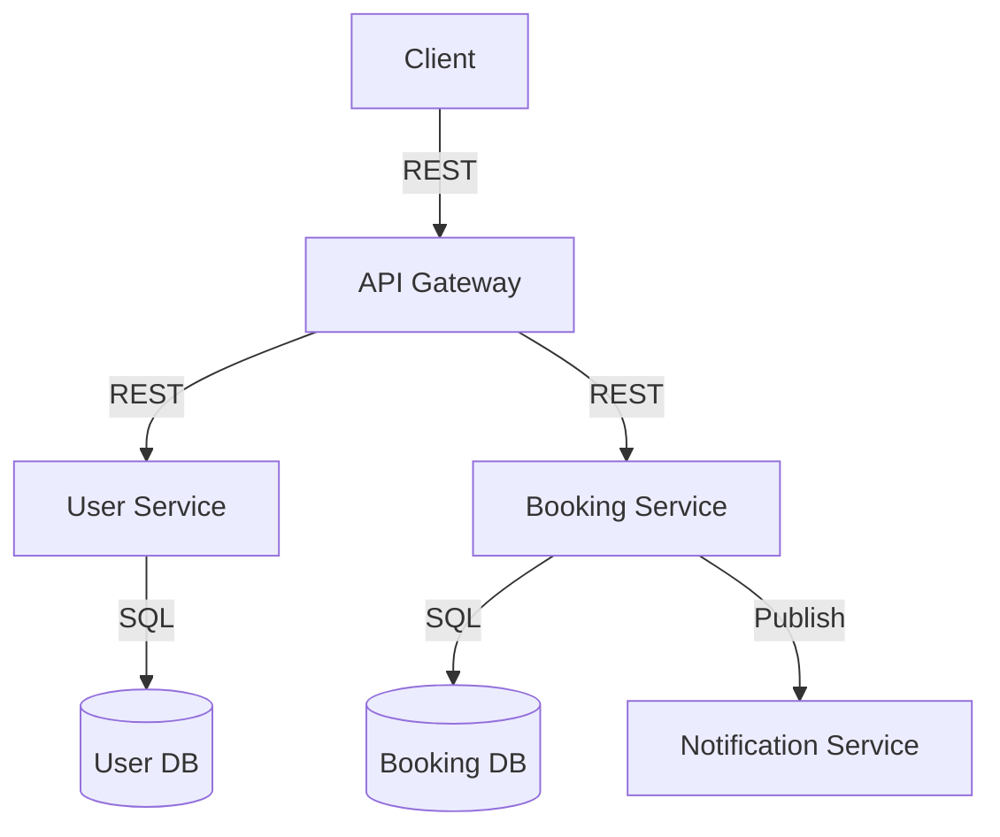

# Техническое решение (ТР)  
## Приложение для бронирования мест в коворкинге

---

## 1. Введение

**Краткое описание:**  
Данный проект — это прототип распределенной системы для онлайн-бронирования рабочих мест в коворкинге через веб-приложение. Система обеспечивает регистрацию пользователей, просмотр доступных мест, бронирование и отмену брони, а также просмотр истории бронирований.

**Цель проекта:**  
Реализовать отказоустойчивую, масштабируемую распределенную систему бронирования мест в коворкинге с минимальным временем отклика и устойчивостью к сбоям отдельных компонентов.

**Задачи:**  
- Разработать сервисы для управления пользователями и бронированиями  
- Обеспечить согласованность и распределённое хранение данных  
- Реализовать API для взаимодействия с клиентским приложением  
- Реализовать истории действий пользователя  
- Обеспечить отказоустойчивость и масштабируемость

**Основание для разработки:**  
Учебный проект в рамках курса «Основы распределённых вычислений».

**Состав команды:**  
- Иванов Иван — backend-разработка  
- Петров Петр — архитектура, инфраструктура  
- Сидорова Мария — тестирование, документация  

---

## 2. Глоссарий

| Термин             | Определение                                                                        |
|--------------------|------------------------------------------------------------------------------------|
| Пользователь       | Зарегистрированный клиент приложения                                               |
| Коворкинг          | Пространство с рабочими местами для бронирования                                   |
| Рабочее место      | Конкретная локация в коворкинге, которую можно забронировать                       |
| Слот               | Временной интервал, на который можно забронировать место                           |
| Бронирование       | Операция по резервированию рабочего места                                          |
| API Gateway        | Входная точка для клиентских запросов                                              |
| Сервис бронирования| Микросервис, управляющий логикой бронирования и распределенным состоянием           |
| Распределенное состояние | Данные, хранящиеся на нескольких сервисах/узлах                                |
| Консистентность    | Свойство согласованности данных между экземплярами системы                         |
| Отказоустойчивость | Способность системы продолжать работу при сбое компонентов                         |

---

## 3. Функциональные требования

- Пользователь может зарегистрироваться и войти в систему
- Пользователь может просмотреть список доступных мест и свободных слотов
- Пользователь может забронировать свободное место на определённое время
- Пользователь может отменить свою бронь
- Пользователь может просмотреть историю своих бронирований

---

## 4. Ограничения по предметной области

- Система работает только с одним коворкингом (или фиксированным их списком)
- Время бронирования — строго по слотам (например, по 1 часу)
- Бронирование возможно только для зарегистрированных пользователей
- Оплата и интеграция с платежными системами не реализована (только резервация)
- Регистрация — упрощённая (логин + пароль, без email-подтверждения и сложных проверок)

---

## 5. Нефункциональные требования

- **Доступность:** ≥ 99.9%
- **Время отклика:** ≤ 200 мс при 100 одновременных пользователях
- **Отказоустойчивость:** система продолжает работу при сбое любого одного узла
- **Масштабируемость:** поддержка горизонтального масштабирования сервисов
- **Консистентность:** данные о бронированиях не теряются и не дублируются, система защищена от гонок на уровне бронирования одного и того же места

---

## 6. Пользовательские сценарии

### Сценарий 1: Бронирование места
1. Пользователь заходит на сайт, выбирает дату и время.
2. Система показывает свободные места.
3. Пользователь выбирает место и нажимает “Забронировать”.
4. Система подтверждает бронь и отображает её в личном кабинете.

### Сценарий 2: Отмена бронирования
1. Пользователь открывает раздел “Мои бронирования”.
2. Выбирает бронь, которую хочет отменить.
3. Система отменяет бронь и возвращает место в список доступных.

### Сценарий 3: Просмотр истории бронирований
1. Пользователь открывает раздел “История”.
2. Система отображает все текущие и завершённые бронирования пользователя.

---

## 7. Архитектура

### Описание архитектуры

Система построена по микросервисной архитектуре:

- **API Gateway** — принимает все клиентские запросы, маршрутизирует их по сервисам, занимается базовой аутентификацией.
- **User Service** — сервис для регистрации/аутентификации пользователей, хранит данные пользователей.
- **Booking Service** — основной сервис для логики бронирования, хранения и обработки заявок.
- **Booking DB** — распределённая база данных для хранения информации о бронированиях.
- **User DB** — база данных для хранения пользователей.
- **Notification Service** (опционально) — отправка уведомлений о подтверждении/отмене брони.
- **Message Broker** (опционально) — для событий, если потребуется асинхронность (например, для уведомлений или аналитики).

### Диаграмма компонентов (Mermaid)

---

## 8. Технические сценарии

### Сценарий: Бронирование места

1. Клиент отправляет в API Gateway запрос POST `/book` с параметрами: место, дата, время.
2. API Gateway перенаправляет запрос в Booking Service.
3. Booking Service проверяет доступность слота, создает бронь, сохраняет запись в Booking DB.
4. Booking Service отправляет подтверждение в API Gateway.
5. API Gateway возвращает клиенту успешный ответ.

### Сценарий: Отмена бронирования

1. Клиент отправляет POST `/cancel` с id бронирования.
2. API Gateway -> Booking Service.
3. Booking Service удаляет бронь из Booking DB.
4. Booking Service отправляет результат в API Gateway.
5. API Gateway — клиенту.

### Сценарий: Просмотр истории

1. Клиент отправляет GET `/history`.
2. API Gateway -> Booking Service.
3. Booking Service возвращает список всех бронирований пользователя.

---

## 9. План разработки и тестирования

### MVP (минимальный жизнеспособный продукт)

- Проектирование API для регистрации, входа, бронирования, отмены, истории
- Реализация API Gateway (роутинг, авторизация)
- Реализация User Service (регистрация, логин)
- Реализация Booking Service (логика бронирования, отмены, истории)
- Интеграция с транзакционной базой данных (Booking DB, User DB)
- Покрытие сервисов unit и интеграционными тестами
- Документация и схемы

### Advanced Scope (после MVP)

- Интеграция с Message Broker для событий (например, для аналитики или уведомлений)
- Notification Service (email или пуш-уведомления)
- Поддержка нескольких коворкингов
- Масштабирование и отказоустойчивость

### План тестирования

- Проверка регистрации и входа
- Проверка бронирования свободного места
- Проверка обработки конкурирующих запросов на одно место (нет двойных бронирований)
- Проверка отмены брони
- Проверка истории бронирований
- Проверка работы системы при отказе одного из сервисов

---

## 10. Definition of Done (DoD)

- Все основные сценарии реализованы и покрыты тестами
- Все сервисы покрыты unit и интеграционными тестами
- Документация (ТР, описание API, архитектура) актуальна
- Все тесты проходят в CI
- Система корректно работает при сбое любого одного узла
- Проведены тестовые бронирования, конкурирующие бронирования не приводят к ошибкам консистентности

---

## 11. Ссылки и инструменты

- [Draw.io](https://draw.io) — для составления диаграмм
- [Mermaid](https://mermaid-js.github.io) — для диаграмм в Markdown
- [GitHub Actions](https://docs.github.com/en/actions) — для CI/CD
- [FastAPI](https://fastapi.tiangolo.com/), [Flask](https://flask.palletsprojects.com/) — возможные фреймворки для Python, если выбран этот язык
- [PostgreSQL](https://www.postgresql.org/) или [Redis](https://redis.io/) — БД для хранения состояния
- [pytest](https://docs.pytest.org/) — для тестирования

---

## 12. Приложения

- Диаграммы последовательностей (по мере реализации)
- Примеры запросов к API
- Описание структуры данных
