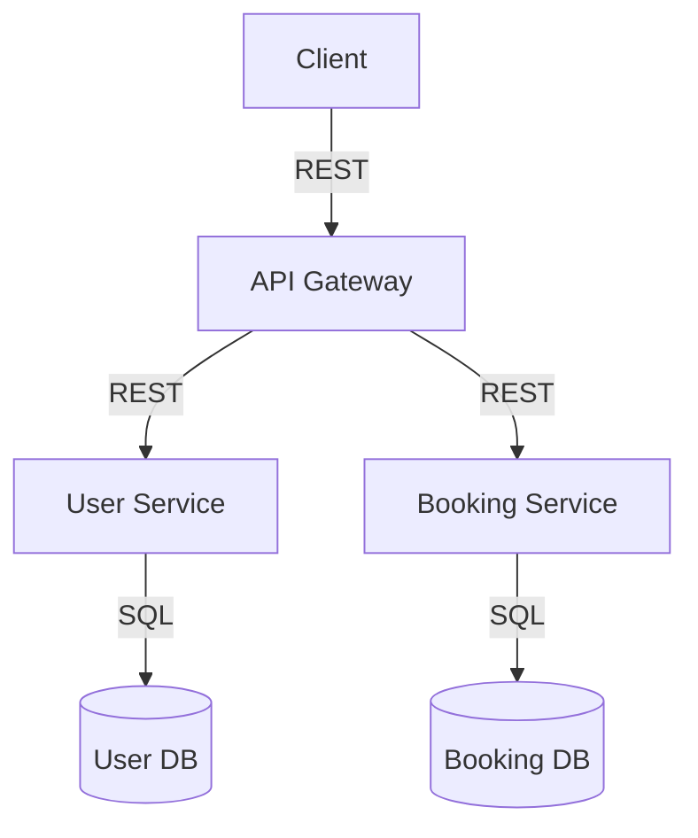
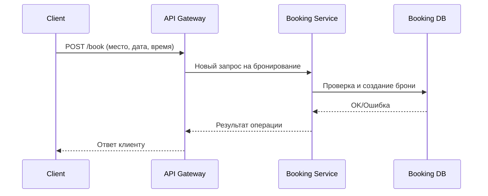

# Техническое решение проекта «Распределённая система онлайн-бронирования мест в коворкинге»

## Введение

**Краткое описание:**  
Разрабатывается распределённая система онлайн-бронирования рабочих мест в коворкинге. Система позволяет пользователям регистрироваться, просматривать доступные места, создавать и отменять бронирования, а также просматривать историю своих действий. Проект реализуется с нуля без использования готовых распределённых СУБД и фреймворков.

**Цель проекта:**  
Создать отказоустойчивое и масштабируемое приложение для бронирования мест в коворкинге, обеспечивающее высокую доступность и корректную обработку конкурирующих запросов.

**Задачи:**  
- Реализовать сервисы для управления пользователями и бронированиями.
- Обеспечить распределённое хранение и согласованность состояния.
- Разработать API для внешних клиентов.
- Обеспечить покрытие ключевых пользовательских сценариев тестами.
- Подготовить документацию и архитектурные схемы.

**Основание для разработки:**  
Учебный проект по курсу "Основы распределённых вычислений".

**Состав команды:**  
- Иванов Иван — backend-разработка  
- Петров Петр — архитектура, инфраструктура  
- Сидорова Мария — тестирование, документация  

---

## Глоссарий

| Термин             | Определение                                                                        |
|--------------------|------------------------------------------------------------------------------------|
| Пользователь       | Зарегистрированный клиент приложения                                               |
| Коворкинг          | Пространство с рабочими местами для бронирования                                   |
| Рабочее место      | Конкретная локация в коворкинге, которую можно забронировать                       |
| Слот               | Временной интервал, на который можно забронировать место                           |
| Бронирование       | Операция по резервированию рабочего места                                          |
| API Gateway        | Точка входа для клиентских запросов                                                |
| Booking Service    | Сервис, управляющий логикой бронирования и распределённым состоянием               |
| Booking DB         | Распределённая база данных для хранения бронирований                               |
| User Service       | Сервис для работы с пользователями (регистрация, вход)                             |
| User DB            | База данных пользователей                                                          |
| Консистентность    | Свойство согласованности данных между экземплярами системы                         |
| Отказоустойчивость | Способность системы продолжать работу при сбое компонентов                         |

---

## Функциональные требования

### Управление пользователями
- Регистрация нового пользователя.
- Вход пользователя в систему.

### Бронирование
- Просмотр доступных мест по дате/времени.
- Создание бронирования места на определённый слот.
- Отмена ранее созданного бронирования.

### История
- Просмотр истории своих бронирований.

---

## Ограничения предметной области

- Система реализует бронирование только для одного коворкинга.
- Время бронирования — фиксированные слоты (например, часовые).
- Только зарегистрированные пользователи могут бронировать.
- Оплата бронирования не реализована.
- Регистрация — по логину и паролю, без подтверждения email.

---

## Нефункциональные требования

- Доступность: ≥ 99.9%.
- Время отклика: ≤ 200 мс при 100 одновременных пользователях.
- Отказоустойчивость: система продолжает работу при сбое любого одного узла.
- Горизонтальная масштабируемость.
- Консистентность: отсутствие двойных бронирований, сохранность данных при сбоях.

---

## Пользовательские сценарии

### User Story 1: Бронирование места

1. Пользователь выбирает дату, время и место.
2. Система отображает свободные места.
3. Пользователь подтверждает бронирование.
4. Система сохраняет бронь, возвращает подтверждение.

### User Story 2: Отмена бронирования

1. Пользователь открывает раздел "Мои бронирования".
2. Выбирает бронь для отмены.
3. Система отменяет бронь, место становится доступным.

### User Story 3: Просмотр истории

1. Пользователь открывает раздел "История".
2. Система отображает все актуальные и завершённые бронирования пользователя.

---

## Архитектура

### Описание

Система построена по микросервисной архитектуре. Основные компоненты:

- **API Gateway** — маршрутизация клиентских запросов, аутентификация.
- **User Service** — регистрация/аутентификация пользователей, хранение данных о пользователях.
- **Booking Service** — логика бронирования и отмены, работа с распределённым состоянием.
- **Booking DB** — распределённая база данных для бронирований.
- **User DB** — база данных пользователей.
- **(Опционально) Notification Service** — отправка уведомлений пользователям.

### Диаграмма компонентов (Mermaid)

---

## Технические сценарии

### Сценарий: Создание бронирования

1. Клиент отправляет POST `/book` с параметрами: место, дата, время.
2. API Gateway отправляет запрос в Booking Service.
3. Booking Service проверяет слот, создает бронь, сохраняет в Booking DB.
4. Booking Service возвращает результат в API Gateway.
5. API Gateway — клиенту.

### Сценарий: Отмена бронирования

1. Клиент отправляет POST `/cancel` с id бронирования.
2. API Gateway → Booking Service.
3. Booking Service отменяет бронь в Booking DB.
4. Booking Service возвращает статус в API Gateway.
5. API Gateway — клиенту.

### Сценарий: Просмотр истории

1. Клиент отправляет GET `/history`.
2. API Gateway → Booking Service.
3. Booking Service возвращает список всех бронирований пользователя.

#### Диаграмма последовательности (Mermaid)

---

## План разработки и тестирования

### MVP

- Проектирование API (регистрация, вход, бронирование, отмена, история)
- Реализация API Gateway
- Реализация User Service
- Реализация Booking Service
- Интеграция с базами данных
- Покрытие сценариев unit и интеграционными тестами
- Диаграммы и документация

### Advanced Scope

- Notification Service (опционально)
- Поддержка нескольких коворкингов
- Расширенная аналитика
- Масштабирование и отказоустойчивость на уровне инфраструктуры

### План тестирования

- Регистрация и вход
- Бронирование свободного места
- Одновременные запросы на одно место (нет двойных броней)
- Отмена брони
- История бронирований
- Работа при сбое сервисов

---

## Definition of Done (DoD)

- Все ключевые сценарии реализованы и покрыты тестами.
- Все сервисы покрыты unit и интеграционными тестами.
- Документация (ТР, API, архитектура) актуальна.
- Все тесты проходят в CI.
- Система корректно работает при сбое одного узла.
- Проведены тестовые бронирования, нет ошибок консистентности.

---

## Ссылки и инструменты

- [Draw.io](https://draw.io) — диаграммы
- [Mermaid](https://mermaid-js.github.io) — встроенные диаграммы в Markdown
- [GitHub Actions](https://docs.github.com/en/actions) — для CI/CD
- [FastAPI](https://fastapi.tiangolo.com/), [Flask](https://flask.palletsprojects.com/) — web-фреймворки
- [PostgreSQL](https://www.postgresql.org/), [Redis](https://redis.io/) — БД
- [pytest](https://docs.pytest.org/) — тесты

---